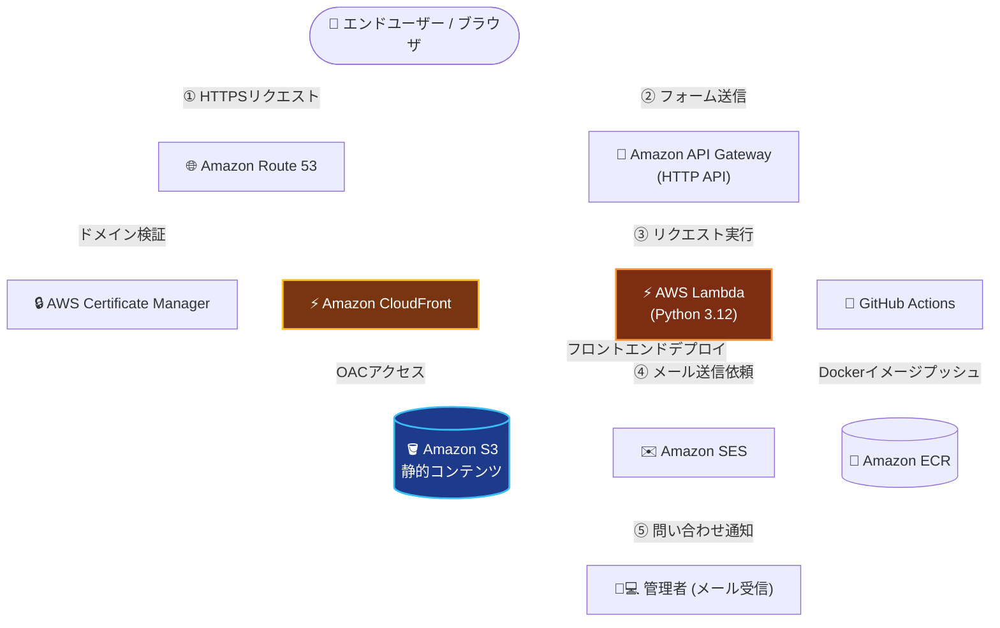

# AWS Serverless Corporate Site

AWSの静的ホスティングおよびサーバレスアーキテクチャを活用して構築した、架空企業（岡田築炉工業所）のコーポレートサイトプロジェクトです。

インフラエンジニアとしての強みである **「高パフォーマンス」「極限のコスト最適化」「IaC（Infrastructure as Code）による環境管理」** を実証・アピールするためのポートフォリオ兼Web基盤テンプレートとして開発されています。

---

## プロジェクトの特長・強み

- **極限のコスト最適化**
  - レンタルサーバーや常時稼働インスタンスを使用せず、S3 + CloudFront による静的配信とサーバレスAPI（API Gateway + Lambda）を採用。
  - アクセス量に応じた完全従量課金設計により、年間1,500円前後の低コスト運用を実現。
- **高パフォーマンス & 高セキュリティ**
  - CloudFront（CDN）によるエッジキャッシュ配信と Route 53 + ACM による自動HTTPS化。
  - S3バケットはパブリックアクセスを完全遮断し、OAC（Origin Access Control）経由のみ許可。
  - サーバーレス構成のためOS/ミドルウェアの保守作業が不要で、OSレベルの脆弱性リスクを排除。
- **完全にコード化されたインフラ（IaC）**
  - リソース全体（S3, CloudFront, Route 53, ACM, API Gateway, Lambda, SES, ECR, IAM等）を **Terraform** で定義。
  - S3リモートステート + DynamoDBロックによるチーム開発対応のステート管理。
  - 環境構築・変更・削除を再現性高くスピーディに実行可能。
- **CI/CD パイプライン**
  - GitHub Actions による自動デプロイ（フロントエンド: S3同期 + CloudFrontキャッシュ削除、バックエンド: ECRへのDockerイメージプッシュ）。
  - OIDC認証によるシークレットレスなAWS認証を採用。

---

## システムアーキテクチャ



### コンポーネント役割と構成のポイント

- **静的コンテンツ配信層（S3 + CloudFront）**
  - S3バケットはパブリックアクセスを完全遮断し、CloudFrontからのアクセスのみをOACで許可。
  - CloudFront（CDN）で世界中のエッジサーバーにキャッシュさせることで、表示速度の高速化とS3転送量の削減を両立。

- **ドメイン・SSL/TLSセキュリティ層（Route 53 + ACM）**
  - Route 53 で独自ドメインのDNS設定を管理（クロスアカウント構成）。
  - ACM（AWS Certificate Manager）で無料発行・自動更新されるSSL/TLS証明書を適用し、サイト全体を完全HTTPS化。

- **完全サーバレスなお問い合わせAPI（API Gateway + Lambda + SES）**
  - フォームからの送信リクエストをAPI Gateway（HTTP API）で受領し、CORS制御を実施。
  - Lambda関数（Python 3.12）が起動してロジックを処理し、Amazon SESを介して管理者へメールを自動通知。
  - サーバーの常時稼働が不要なため、実行時間（数秒）に応じた極めて低い従量課金コストで運用。

- **バックエンドコンテナ（Go + ECR）**
  - Go製のAPIサーバーをDockerコンテナ化し、Amazon ECRで管理。
  - マルチステージビルドにより軽量な本番イメージを生成。

---

## ディレクトリ構成

```
aws-serverless-corporate-site/
├── .github/
│   └── workflows/
│       ├── backend-ci.yml        # バックエンドCI/CD（ECRへのDockerイメージプッシュ）
│       └── deploy-frontend.yml   # フロントエンドデプロイ（S3同期 + CloudFrontキャッシュ削除）
├── backend/
│   ├── src/
│   │   └── lambda_function.py    # Lambda関数（お問い合わせフォーム処理 / SESメール送信）
│   ├── Dockerfile                # Goバックエンド用マルチステージビルド
│   ├── go.mod
│   └── main.go                   # GoバックエンドAPIサーバー
├── frontend/
│   ├── css/
│   ├── images/
│   ├── js/
│   ├── webfonts/
│   ├── index.html                # メインページ（お問い合わせフォーム含む）
│   └── architecture.html         # システム構成紹介ページ
├── terraform/
│   ├── environments/
│   │   └── dev/                  # dev環境の全Terraformリソース定義
│   │       ├── backend.tf        # S3リモートステート設定
│   │       ├── backend_resources.tf  # ステート用S3・DynamoDB・ECRリポジトリ
│   │       ├── iam_github_actions.tf # GitHub Actions OIDC用IAMロール
│   │       ├── main.tf           # メインリソース（S3/CloudFront/Route53/ACM/Lambda/API GW/SES）
│   │       ├── outputs.tf
│   │       ├── provider.tf       # マルチプロバイダ設定（東京/us-east-1/クロスアカウント）
│   │       └── variables.tf
│   └── iam_github_actions.tf     # ルートレベルのIAMロール定義（旧構成）
└── README.md
```

---

## インフラ構成詳細

### Terraform 管理リソース一覧

| リソース | 用途 |
|---|---|
| `aws_s3_bucket` | 静的サイトホスティング用 / Terraformステート保存用 |
| `aws_cloudfront_distribution` | CDN配信・HTTPS強制 |
| `aws_cloudfront_origin_access_control` | S3へのOACアクセス制御 |
| `aws_acm_certificate` | SSL/TLS証明書（us-east-1で発行） |
| `aws_route53_record` | ドメインのAレコード・ACM検証レコード |
| `aws_apigatewayv2_api` | HTTP API（CORS設定済み） |
| `aws_lambda_function` | お問い合わせフォーム処理（Python 3.12） |
| `aws_ses_email_identity` | SES送信元メールアドレス検証 |
| `aws_iam_role` | Lambda実行ロール / GitHub Actions OIDCロール |
| `aws_dynamodb_table` | Terraformステートロック用 |
| `aws_ecr_repository` | バックエンドDockerイメージ管理 |
| `aws_iam_openid_connect_provider` | GitHub Actions OIDC認証 |

### マルチプロバイダ構成

```hcl
# 東京リージョン（メイン）
provider "aws" { region = "ap-northeast-1" }

# バージニア北部（CloudFront用ACM証明書）
provider "aws" { alias = "us_east_1"; region = "us-east-1" }

# クロスアカウント（Route 53管理アカウント）
provider "aws" { alias = "management"; assume_role { role_arn = "..." } }
```

### Terraformステート管理

- ステートファイル: `s3://okadachikuro-dev-tfstate/dev/terraform.tfstate`
- ロック: DynamoDB テーブル `terraform-locks-dev`

---

## CI/CD パイプライン

### フロントエンド（`deploy-frontend.yml`）

`frontend/` 配下の変更を `main` ブランチにプッシュすると自動実行。

1. S3バケットへファイル同期（`aws s3 sync`）
2. CloudFrontキャッシュ削除（`create-invalidation`）

### バックエンド（`backend-ci.yml`）

`backend/` 配下の変更を `main` ブランチにプッシュすると自動実行。

1. Goのビルド・テスト
2. DockerイメージをビルドしてECRへプッシュ

> 両ワークフローともAWS認証はOIDC（シークレットレス）を採用予定。現在は `AWS_ACCESS_KEY_ID` / `AWS_SECRET_ACCESS_KEY` シークレットを使用。

---

## セットアップ手順

### 前提条件

- Terraform >= 1.0.0
- AWS CLI（`dev` プロファイル設定済み）
- Python 3.12（Lambda関数のローカルテスト用）

### デプロイ手順

```bash
# 1. ステート用リソースを先に作成（初回のみ）
cd terraform/environments/dev
# backend.tf の backend "s3" ブロックをコメントアウトした状態で実行
terraform init
terraform apply -target=aws_s3_bucket.tf_state -target=aws_dynamodb_table.tf_locks

# 2. backend.tf のコメントアウトを外してステートをS3に移行
terraform init -migrate-state

# 3. 残りのリソースをデプロイ
terraform apply
```

### フロントエンドの手動デプロイ

```bash
aws s3 sync frontend/ s3://<バケット名> --profile dev
aws cloudfront create-invalidation --distribution-id <ディストリビューションID> --paths "/*" --profile dev
```
