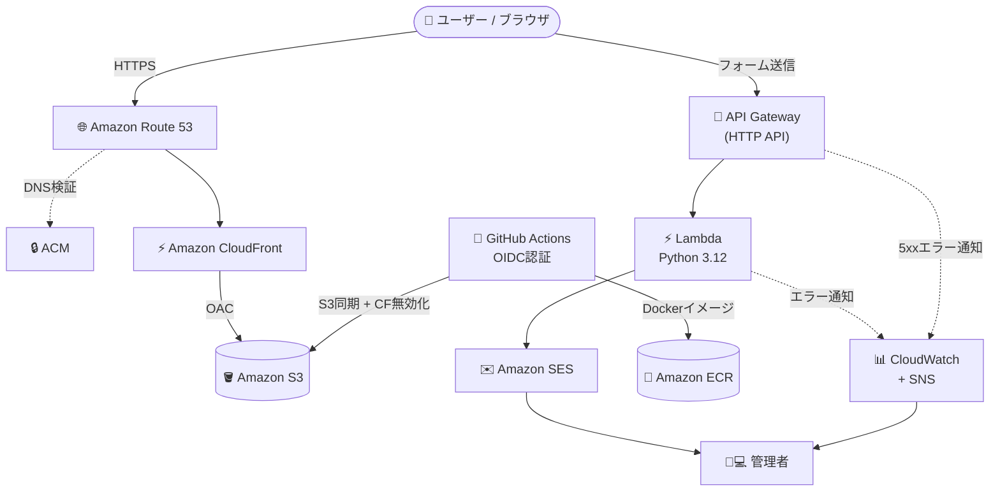

# AWS Serverless Portfolio Site

AWSのサーバーレスアーキテクチャを活用して構築した、インフラエンジニア（岡田誠）の個人ポートフォリオサイトです。

インフラエンジニアとしての強みである **「高パフォーマンス」「極限のコスト最適化」「IaC（Infrastructure as Code）による環境管理」** を実証・アピールするためのポートフォリオ兼Web基盤テンプレートとして開発しています。

🌐 **サイトURL**: [okada-chikuro-kougyousyo.com](https://okada-chikuro-kougyousyo.com)

---

## プロジェクトの特長・強み

- **極限のコスト最適化**
  - レンタルサーバーや常時稼働インスタンスを使用せず、S3 + CloudFront による静的配信とサーバレスAPI（API Gateway + Lambda）を採用。
  - アクセス量に応じた完全従量課金設計により、年間約1,500円の低コスト運用を実現。
- **高パフォーマンス & 高セキュリティ**
  - CloudFront（CDN）によるエッジキャッシュ配信と Route 53 + ACM による自動HTTPS化。
  - S3バケットはパブリックアクセスを完全遮断し、OAC（Origin Access Control）経由のみ許可。
  - サーバーレス構成のためOSレベルの脆弱性リスクを排除。
- **完全にコード化されたインフラ（IaC）**
  - 全リソース（S3, CloudFront, Route 53, ACM, API Gateway, Lambda, SES, ECR, IAM, CloudWatch, SNS等）を **Terraform** で定義。
  - S3ネイティブロック（`use_lockfile = true`）によるステート管理。
  - マルチプロバイダ・クロスアカウント構成（Route 53管理アカウントへの `assume_role`）。
- **CI/CD パイプライン**
  - GitHub Actions による自動デプロイ（フロントエンド: S3同期 + CloudFrontキャッシュ削除、バックエンド: ECRへのDockerイメージプッシュ）。
  - OIDC認証によるシークレットレスなAWS認証を採用。
- **監視・アラート**
  - CloudWatch + SNS によるLambdaエラー・API Gateway 5xxエラーの自動通知。

---

## システムアーキテクチャ



---

## ディレクトリ構成

```
portfolio/
├── .github/
│   └── workflows/
│       ├── backend-ci.yml        # バックエンドCI/CD（ECRへのDockerイメージプッシュ）
│       └── deploy-frontend.yml   # フロントエンドデプロイ（S3同期 + CloudFrontキャッシュ削除）
├── backend/
│   ├── src/
│   │   └── lambda_function.py    # Lambda関数（お問い合わせフォーム処理 / SESメール送信）
│   ├── Dockerfile                # Goバックエンド用マルチステージビルド
│   ├── go.mod
│   └── main.go                   # GoバックエンドAPIサーバー
├── frontend/
│   ├── css/
│   ├── images/
│   ├── js/
│   ├── webfonts/
│   ├── index.html                # ポートフォリオメインページ（About / Skills / Works / Contact）
│   └── architecture.html         # システム構成紹介ページ
├── terraform/
│   └── environments/
│       └── dev/
│           ├── backend.tf            # S3リモートステート設定
│           ├── backend_resources.tf  # ステート用S3・DynamoDB・ECRリポジトリ
│           ├── cloudwatch.tf         # CloudWatch アラーム・SNS通知
│           ├── iam_github_actions.tf # GitHub Actions OIDC用IAMロール（フロント・バック）
│           ├── main.tf               # メインリソース（S3/CloudFront/Route53/ACM/Lambda/API GW/SES）
│           ├── outputs.tf
│           ├── provider.tf           # マルチプロバイダ設定（東京/us-east-1/クロスアカウント）
│           └── variables.tf
└── README.md
```

---

## インフラ構成詳細

### Terraform 管理リソース一覧

| リソース | 用途 |
|---|---|
| `aws_s3_bucket` | 静的サイトホスティング用 / Terraformステート保存用 |
| `aws_cloudfront_distribution` | CDN配信・HTTPS強制 |
| `aws_cloudfront_origin_access_control` | S3へのOACアクセス制御 |
| `aws_acm_certificate` | SSL/TLS証明書（us-east-1で発行） |
| `aws_route53_record` | ドメインのAレコード・ACM検証レコード |
| `aws_apigatewayv2_api` | HTTP API（CORS設定済み） |
| `aws_lambda_function` | お問い合わせフォーム処理（Python 3.12） |
| `aws_ses_email_identity` | SES送信元メールアドレス検証 |
| `aws_iam_role` | Lambda実行ロール / GitHub Actions OIDCロール（フロント・バック） |
| `aws_cloudwatch_metric_alarm` | Lambdaエラー・API Gateway 5xxエラー監視 |
| `aws_sns_topic` | CloudWatchアラームのメール通知先 |
| `aws_ecr_repository` | バックエンドDockerイメージ管理 |
| `aws_iam_openid_connect_provider` | GitHub Actions OIDC認証 |

### マルチプロバイダ構成

```hcl
# 東京リージョン（メイン）
provider "aws" { region = "ap-northeast-1" }

# バージニア北部（CloudFront用ACM証明書）
provider "aws" { alias = "us_east_1"; region = "us-east-1" }

# クロスアカウント（Route 53管理アカウント）
provider "aws" { alias = "management"; assume_role { role_arn = "..." } }
```

### Terraformステート管理

- ステートファイル: `s3://okadachikuro-dev-tfstate/dev/terraform.tfstate`
- ロック: S3ネイティブロック（`use_lockfile = true`）

---

## CI/CD パイプライン

### フロントエンド（`deploy-frontend.yml`）

`frontend/` 配下の変更を `main` ブランチにプッシュすると自動実行。

1. OIDC認証でAWSに接続（`AWS_FRONTEND_ROLE_ARN`）
2. S3バケットへファイル同期（`aws s3 sync`）
3. CloudFrontキャッシュ削除（`create-invalidation`）

### バックエンド（`backend-ci.yml`）

`backend/` 配下の変更を `main` ブランチにプッシュすると自動実行。

1. Goのビルド・テスト
2. OIDC認証でAWSに接続（`AWS_BACKEND_ROLE_ARN`）
3. DockerイメージをビルドしてECRへプッシュ

> 両ワークフローともOIDC認証（シークレットレス）を採用。

---

## セットアップ手順

### 前提条件

- Terraform >= 1.0.0
- AWS CLI（`dev` プロファイル設定済み）
- Python 3.12（Lambda関数のローカルテスト用）

### デプロイ手順

```bash
# 1. ステート用リソースを先に作成（初回のみ）
cd terraform/environments/dev
# backend.tf の backend "s3" ブロックをコメントアウトした状態で実行
terraform init
terraform apply -target=aws_s3_bucket.tf_state

# 2. backend.tf のコメントアウトを外してステートをS3に移行
terraform init -migrate-state

# 3. 残りのリソースをデプロイ
terraform apply
```

### フロントエンドの手動デプロイ

```bash
aws s3 sync frontend/ s3://<バケット名> --profile dev
aws cloudfront create-invalidation --distribution-id <ディストリビューションID> --paths "/*" --profile dev
```
