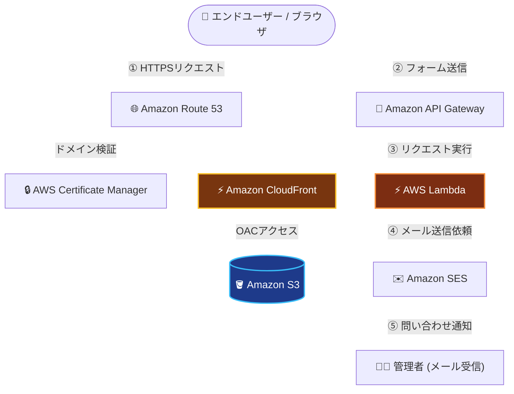

# AWS Serverless Corporate Site

AWSの静的ホスティングおよびサーバレスアーキテクチャを活用して構築した、架空企業（CloudX Inc.）のコーポレートサイトプロジェクトです。

インフラエンジニアとしての強みである **「高パフォーマンス」「極限のコスト最適化」「IaC（Infrastructure as Code）による環境管理」** を実証・アピールするためのポートフォリオ兼Web基盤テンプレートとして開発されています。

---

## プロジェクトの特長・強み

- **極限のコスト最適化**
  - レンタルサーバーや常時稼働インスタンスを使用せず、S3 + CloudFront による静的配信とサーバレスAPI（API Gateway + Lambda）を採用。
  - アクセス量に応じた完全従量課金設計により、年間1,500円前後の低コスト運用を実現。
- **高パフォーマンス & 高セキュリティ**
  - CloudFront（CDN）によるエッジキャッシュ配信と Route 53 + ACM による自動HTTPS化。
  - サーバーレス構成のためOS/ミドルウェアの保守作業が不要で、OSレベルの脆弱性リスクを排除。
- **完全にコード化されたインフラ（IaC）**
  - リソース全体（S3, CloudFront, Route 53, API Gateway, Lambda, SES等）を **Terraform** で定義。
  - 環境構築・変更・削除を再現性高くスピーディに実行可能。

---

## システムアーキテクチャ

### コンポーネント役割と構成のポイント

* **静的コンテンツ配信層（S3 + CloudFront）**
* S3バケットはパブリックアクセスを完全遮断し、CloudFrontからのアクセスのみを **OAC（Origin Access Control）** で許可。
* CloudFront（CDN）で世界中のエッジサーバーにキャッシュさせることで、表示速度の爆速化とS3転送量の削減を両立。

* **ドメイン・SSL/TLSセキュリティ層（Route 53 + ACM）**
* Route 53 で独自ドメインのDNS設定を管理。
* ACM（AWS Certificate Manager）で無料発行・自動更新されるSSL/TLS証明書を適用し、サイト全体を完全HTTPS化。

* **完全サーバレスなお問い合わせAPI（API Gateway + Lambda + SES）**
* フォームからの送信リクエストを API Gateway で受領し、CORS制御およびパラメータバリデーションを実施。
* Lambda 関数が起動してロジックを処理し、Amazon SES を介して管理者へメールを自動通知。
* サーバーの常時稼働が不要なため、実行時間（数秒）に応じた極めて低い従量課金コストで運用。
